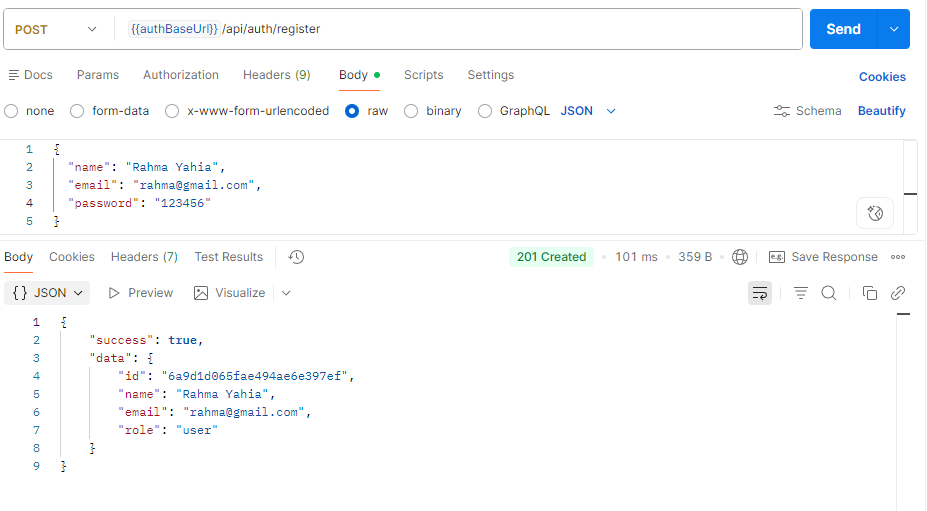
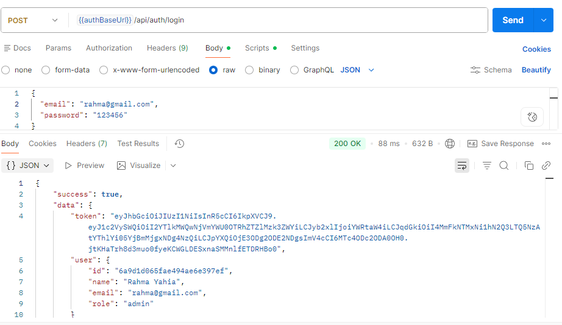
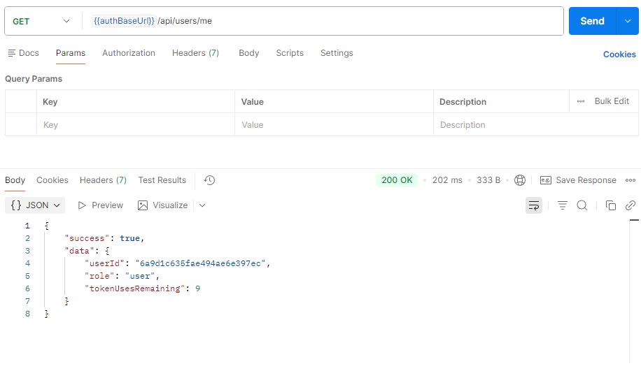
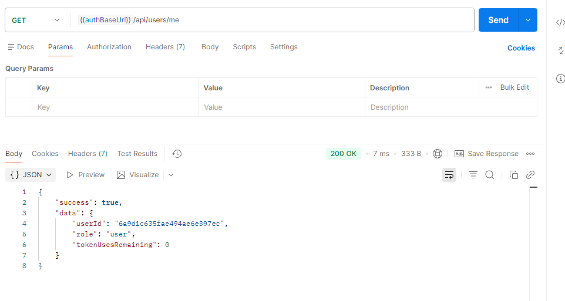
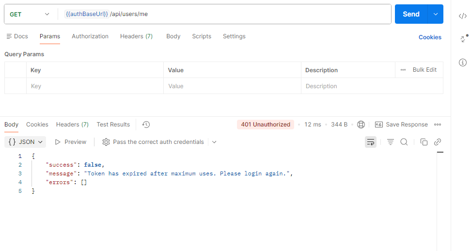
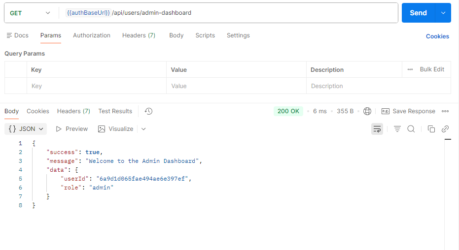

# JWT Authentication API — Vampire Token Protocol

A token-based authentication system built with Node.js, Express, and MongoDB. Developed as part of the Arithmatrix Virtual Internship Program (AVIP 2026) — Backend Development Track, Task 3.

## Features

- User registration with hashed passwords (bcrypt)
- JWT-based login with token issuance
- **Vampire Token Protocol**: each token is tracked server-side and automatically revoked after exactly 10 uses, forcing re-authentication
- Role-based access control (`user` / `admin`)
- Centralized error handling
- Clean layered architecture (Controller → Service → Model)

## Tech Stack

| Technology | Purpose |
|---|---|
| Node.js / Express | Server and routing |
| MongoDB + Mongoose | Persistence for users and token sessions |
| bcryptjs | Password hashing |
| jsonwebtoken | Token signing and verification |
| uuid | Unique token identifiers (`jti`) |
| Joi | Request validation |

## How the Vampire Token Works

Unlike a standard JWT (which is stateless), this system tracks every issued token in a `TokenSession` document containing:

- `jti` — unique token identifier
- `usesRemaining` — starts at 10, decreases by 1 on every authenticated request
- `isRevoked` — set to `true` once uses reach 0

Every protected request goes through two checks:
1. Cryptographic validation (`jwt.verify`) — is the signature valid and not expired?
2. Session validation (database lookup) — is this specific token still alive?

Once a token's `usesRemaining` hits 0, it is revoked in the database, and any further request with that token is rejected with `401`, even though the token itself is still cryptographically valid.

## Running the Server

```bash
npm run dev
```

Server runs on `http://localhost:5001`.

## API Endpoints

Base URL: `http://localhost:5001/api`

| Method | Endpoint | Auth Required | Description |
|---|---|---|---|
| POST | `/auth/register` | No | Register a new user |
| POST | `/auth/login` | No | Login and receive a Vampire Token |
| GET | `/users/me` | Yes | Get current user profile (consumes 1 token use) |
| GET | `/users/admin-dashboard` | Yes (admin only) | Admin-only protected route |

## Sample Requests & Responses

### 1. Register User


### 2. Login User


### 3. First Use of Token (usesRemaining: 9)


### 4. Tenth Use of Token (usesRemaining: 0)


### 5. Eleventh Request — Token Revoked (401)


### 6. Admin Dashboard Access


## Role-Based Access Setup

New users default to the `user` role. To test the admin route, manually update a user's `role` field to `"admin"` in MongoDB, then log in again to receive a fresh token reflecting the updated role.
